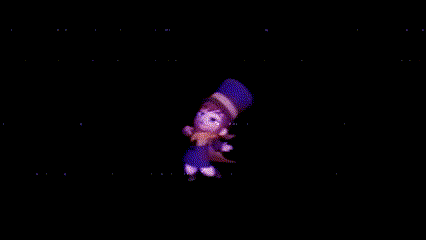
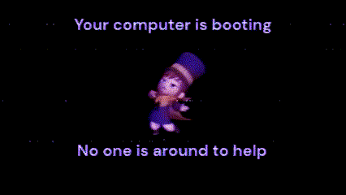

# What this?

It's a repository that can convert the videos in [sources](./sources) into PNG sequences usable as Plymouth themes.

# How do?

Using `extract_pngs.sh`

```bash
$ ./extract_pngs.sh 
Convert hat kid MP4s to PNG sequences for use with Plymouth

Usage:
  extract_pngs.sh --mode MODE [options]

Flags:
  --mode MODE        'long' for long video, 'short' for short video
  --trim-frames N    Trim every N-th frame of the generated PNG sequence
```

If `--mode` is `long`, then it converts [hat-kid-boot.mp4](./sources/hat-kid-boot.mp4). If it's `--short`, it converts [hat-kid-boot-short.mp4](./sources/hat-kid-boot-short.mp4).

The output images are placed in `hat-kid/throbber-*.png`. If you copy `hat-kid` to `/usr/share/plymouth/themes`, then you can activate it with i.e. `plymouth-set-default-theme hat-kid --rebuild-initrd`

**Note: check the size of the generated initrd/initramfs before rebooting. It is possible to stop your system from booting due to grub facing memory allocation issues.**

To reduce the number of frames generated, you can use the `--trim-frames` argument. This also has the effect of speeding up the generated animation and is pretty funny.

# Preview?

## Long


## Short
